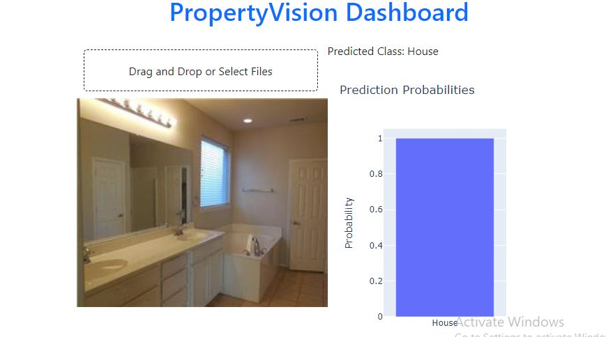

# Data_Analysis_Tool_for_Data_Insights_Marketing_Agency

# PropertyVision Dashboard

## Overview

This project is a web-based application that uses a deep learning model to classify images of properties into different categories. The application is built using [Dash](https://dash.plotly.com/), a Python framework for building analytical web applications, and integrates a pre-trained [VGG16](https://keras.io/api/applications/vgg/#vgg16-function) model fine-tuned for this specific task. The dashboard allows users to upload images of properties and receive predictions along with probability distributions for various classes.

## Features

- **Image Upload**: Users can drag and drop or select image files to be classified by the model.
- **Real-Time Prediction**: The model predicts the class of the uploaded image in real-time.
- **Probability Visualization**: A bar chart shows the probability distribution across all classes for the uploaded image.
- **Pre-trained Model**: The application uses a fine-tuned VGG16 model, originally trained on the ImageNet dataset, for property classification.

## Dataset

The images used to train the model were downloaded from Google Drive and preprocessed for model training. The dataset includes images of various property types and conditions, which were used to fine-tune the VGG16 model.

- **Dataset Source**: The dataset was downloaded from [this Google Drive link](https://drive.google.com/uc?id=1zLNe-QteUWjlNLmyWSfiB-D8ZxdPZAFs).
- **Dataset Size**: The dataset contains images of different property types, including houses, apartments, offices, and architectural styles.

## Model Architecture

The project uses a convolutional neural network based on the VGG16 architecture:

- **Base Model**: VGG16 pre-trained on ImageNet.
- **Fine-Tuning**: The final layers of the VGG16 model were retrained to adapt to the property classification task.
- **Additional Layers**:
  - Global Average Pooling layer.
  - Fully Connected (Dense) layer with 1024 units and ReLU activation.
  - Output layer with softmax activation for multi-class classification.

### Training

The model was trained using images from the dataset with the following configuration:

- **Image Size**: 224x224 pixels.
- **Batch Size**: 32.
- **Optimizer**: Adam with an initial learning rate of 0.001, later fine-tuned with a learning rate of 0.1.
- **Loss Function**: Categorical Crossentropy.
- **Metrics**: Accuracy.

### Evaluation

The model was evaluated using validation data, and the performance was measured using metrics such as accuracy, confusion matrix, and classification report. The model achieved a satisfactory level of accuracy for the given task.

## Application Details

The application is built using Dash, with a simple and user-friendly interface:

- **File Upload**: Allows users to upload an image for classification.
- **Prediction Display**: Displays the predicted class of the uploaded image.
- **Probability Distribution**: A bar chart shows the probability of each class.


### Running the Application

To run the application locally, follow these steps:

1. **Install Dependencies**: Ensure that you have all required Python packages installed.
   ```bash
   pip install dash dash-bootstrap-components tensorflow gdown plotly pillow
